# SolasFlow - Complete App Overhaul Plan

## Overview
Comprehensive overhaul of the existing "Lifer" app to "SolasFlow" with Material You theming, landscape mode fixes, UI corrections, and Play Store release preparation.

---

## Phase 1: Rename App to "SolasFlow"

### Files to modify:

| File | Changes |
|------|---------|
| [`pubspec.yaml`](pubspec.yaml:1) | Change `name: lifer` → `name: solasflow`, update `description` |
| [`android/app/build.gradle.kts`](android/app/build.gradle.kts:9) | Change `namespace = "com.atherpulse.lifer"` → `"com.atherpulse.solasflow"` |
| [`android/app/src/main/AndroidManifest.xml`](android/app/src/main/AndroidManifest.xml:10) | Update `android:label="lifer"` → `"SolasFlow"`, update notification icon metadata name, widget labels |
| [`android/app/src/main/AndroidManifest.xml`](android/app/src/main/AndroidManifest.xml:19-20) | Update `com.atherpulse.lifer.service.NOTIFICATION_ICON` → `com.atherpulse.solasflow.service.NOTIFICATION_ICON` |
| [`android/app/src/main/AndroidManifest.xml`](android/app/src/main/AndroidManifest.xml:59) | Widget label `"Lifer Timer Presets"` → `"SolasFlow Timer Presets"` |
| [`android/app/src/main/AndroidManifest.xml`](android/app/src/main/AndroidManifest.xml:72) | Widget label `"Lifer Speech Controls"` → `"SolasFlow Speech Controls"` |
| [`lib/main.dart`](lib/main.dart:1) | Update header comment, `LiferApp` class → `SolasFlowApp`, strings, method channel `'com.atherpulse.lifer/widget'` → `'com.atherpulse.solasflow/widget'` |
| [`lib/main.dart`](lib/main.dart:137) | `runApp(const LiferApp())` → `runApp(const SolasFlowApp())` |
| [`lib/main.dart`](lib/main.dart:140) | `class LiferApp` → `class SolasFlowApp` |
| [`lib/main.dart`](lib/main.dart:154) | `title: l10n?.appTitle ?? 'lifer'` will auto-update via ARB |
| [`lib/main.dart`](lib/main.dart:312) | MethodChannel `'com.atherpulse.lifer/widget'` → `'com.atherpulse.solasflow/widget'` |
| [`lib/main.dart`](lib/main.dart:342-343) | ForegroundNotificationService icon meta-data name update |
| [`lib/main.dart`](lib/main.dart:715) | `channelId: 'speaktimer_fg'` → `'solasflow_fg'` |
| [`lib/main.dart`](lib/main.dart:716) | `channelName: 'Speak Timer'` → `'SolasFlow'` |
| [`lib/l10n/app_en.arb`](lib/l10n/app_en.arb:3) | `"appTitle": "Lifer"` → `"SolasFlow"` |
| [`lib/l10n/app_ml.arb`](lib/l10n/app_ml.arb:3) | `"appTitle": "ലൈഫർ"` → `"സോളസ്ഫ്ലോ"` |
| [`lib/theme/palette.dart`](lib/theme/palette.dart) | Update header comment references |
| [`android/app/src/main/res/drawable/ic_stat_lifer.png`](android/app/src/main/res/drawable/ic_stat_lifer.png) | Rename drawable files or add new ones (e.g., `ic_stat_solasflow.png`) |
| All mipmap ic_launcher files | Replace/update launcher icons with SolasFlow branding (later phase) |
| [`android/app/src/main/res/xml/speech_controls_widget_info.xml`](android/app/src/main/res/xml/speech_controls_widget_info.xml) | Update widget labels |
| [`android/app/src/main/res/xml/timer_presets_widget_info.xml`](android/app/src/main/res/xml/timer_presets_widget_info.xml) | Update widget labels |

### Key considerations:
- MethodChannel names must match in Dart and native Android code
- Foreground service notification channel IDs are internal but should be updated for consistency
- ARB localization files contain the `appTitle` key that feeds into the app title

---

## Phase 2: Material You (Monet) Dynamic Theming

### Current Problem
All UI panels use **hardcoded color constants** (e.g., `_surface = Color(0xFFFEFBFF)`, `_primary = Color(0xFF3F55F6)`, `_onSurface = Color(0xFF1C1B1F)`). The theme in `_buildLiferTheme()` already uses `ColorScheme.fromSeed()` but the widgets don't consume it.

### Solution Strategy
Replace all hardcoded widget colors with dynamic colors derived from `Theme.of(context).colorScheme`.

### Files to modify:

| File | Changes |
|------|---------|
| [`lib/theme/palette.dart`](lib/theme/palette.dart) | Simplify or remove - no longer needed since widgets will use theme colors |
| [`lib/main.dart`](lib/main.dart:179-278) | Update `_buildLiferTheme()` to use dynamic seed color from platform (Monet). On Android 12+, use `ColorScheme.fromImageProvider` or `dynamic_color` package. Remove hardcoded navigation bar colors. |
| [`lib/widgets/clock_panel.dart`](lib/widgets/clock_panel.dart) | **Major rewrite**: Remove all `_surface`, `_onSurface`, `_primary`, etc. const colors. Replace with `Theme.of(context).colorScheme.surface`, `.onSurface`, `.primary`, etc. |
| [`lib/widgets/timer_panel.dart`](lib/widgets/timer_panel.dart) | Same: Remove hardcoded `_surface`, `_onSurface`, `_primary`, etc. Use theme colors dynamically. |
| [`lib/widgets/stopwatch_panel.dart`](lib/widgets/stopwatch_panel.dart) | Same: Remove hardcoded colors, use theme colors. |
| [`lib/widgets/settings_panel.dart`](lib/widgets/settings_panel.dart) | Same: Remove hardcoded colors, use theme colors. |
| [`lib/widgets/fullscreen_focus_view.dart`](lib/widgets/fullscreen_focus_view.dart) | Update hardcoded colors to use theme-derived colors (light/dark scenarios). |

### Implementation Details:

1. **Add `dynamic_color` package** to [`pubspec.yaml`](pubspec.yaml) for Android 12+ Monet support:
   ```yaml
   dynamic_color: ^1.7.0
   ```

2. **Ensure Material 3 is enabled** — verify `useMaterial3: true` is already present in [`_buildLiferTheme()`](lib/main.dart:186). If missing, add it.

3. **Android version-gated dynamic color**: Use `DynamicColorBuilder` from `dynamic_color` package to extract wallpaper-based colors on Android 12+ (API 31+), with fallback to `ColorScheme.fromSeed()` for older Android and other platforms:
   ```dart
   DynamicColorBuilder(builder: (lightDynamic, darkDynamic) {
     final lightScheme = lightDynamic?.colorScheme ??
       ColorScheme.fromSeed(
         seedColor: Color(0xFF6256D9), // fallback seed
         brightness: Brightness.light,
       );
     final darkScheme = darkDynamic?.colorScheme ??
       ColorScheme.fromSeed(
         seedColor: Color(0xFF6256D9),
         brightness: Brightness.dark,
       );
     return MaterialApp(
       theme: _buildSolasFlowTheme(lightScheme, Brightness.light),
       darkTheme: _buildSolasFlowTheme(darkScheme, Brightness.dark),
       ...
     );
   })
   ```

4. **Update `_buildSolasFlowTheme()`** to accept a `ColorScheme` parameter instead of generating it internally:
   ```dart
   ThemeData _buildSolasFlowTheme(ColorScheme scheme, Brightness brightness) {
     return ThemeData(
       useMaterial3: true,
       colorScheme: scheme,
       brightness: brightness,
       ...
     );
   }
   ```

5. **Widget color migration pattern** (for all 4 widget files):
   - Delete all `const _surface`, `_primary`, `_onSurface`, `_onSurfaceVariant`, `_outline`, `_softBlue`, `_primarySoft` declarations
   - Replace every usage with `Theme.of(context).colorScheme.*` equivalents:
     - `_surface` → `colorScheme.surface`
     - `_primary` → `colorScheme.primary`
     - `_onSurface` → `colorScheme.onSurface`
     - `_onSurfaceVariant` → `colorScheme.onSurfaceVariant`
     - `_outline` → `colorScheme.outlineVariant`
     - `_softBlue` / `_primarySoft` → `colorScheme.primaryContainer.withAlpha(80)`
   - Switch active colors → `colorScheme.primary`
   - **Gradient in clock card** (`clock_panel.dart:210-214`): Replace hardcoded `LinearGradient([Color(0xFF5667FF), Color(0xFF3048E8)])` with `colorScheme.primaryContainer` tinted surface or use `primary` with opacity gradient
   - **Bottom sheet backgrounds**: Use `colorScheme.surfaceContainerLow` instead of hardcoded surface colors

6. **Performance safeguard**: After migrating to Theme.of(context), wrap widget build methods with `Consumer`/`Selector` or extract theme once at the top of `build()` to avoid repeated `Theme.of()` lookups in deep widget trees. For `StatelessWidget` panels, assign to a local variable:
   ```dart
   final cs = Theme.of(context).colorScheme;
   ```

---

## Phase 3: Landscape / Horizontal Mode Fixes

### Current Problem
All panels use `ConstrainedBox(maxWidth: 430)` and `LayoutBuilder` that doesn't properly handle landscape orientation. In landscape, the content is cramped, layouts break, and scroll doesn't work properly in horizontal mode.

### Files to modify:

| File | Changes |
|------|---------|
| [`lib/widgets/clock_panel.dart`](lib/widgets/clock_panel.dart:491-547) | Replace `ConstrainedBox(maxWidth: 430)` with responsive layout using `LayoutBuilder` and `OrientationBuilder`. In landscape, use horizontal layout with side-by-side sections. Ensure the `ListView` wrapper handles horizontal scroll properly. |
| [`lib/widgets/timer_panel.dart`](lib/widgets/timer_panel.dart:743-807) | Same: responsive layout. In landscape, reduce timer ring size, arrange presets and controls horizontally. |
| [`lib/widgets/stopwatch_panel.dart`](lib/widgets/stopwatch_panel.dart:419-477) | Same: responsive layout. In landscape, use a more compact layout. |
| [`lib/widgets/settings_panel.dart`](lib/widgets/settings_panel.dart:475-791) | Same: responsive layout. Settings items should use scrollable columns in landscape. |
| [`lib/widgets/fullscreen_focus_view.dart`](lib/widgets/fullscreen_focus_view.dart) | Already handles orientation via `_forceLandscape` but may need adjustments for proper display when device is physically rotated. |
| [`lib/main.dart`](lib/main.dart:3488-3596) | The scaffold body and navigation bar need proper landscape handling. |

### Implementation Strategy:
- Use `OrientationBuilder` to detect landscape vs portrait
- In landscape:
  - Reduce `maxWidth` constraint or remove it entirely
  - Use `Row` instead of `Column` for main layout where appropriate
  - Increase `SafeArea` usage on all sides; ensure `resizeToAvoidBottomInset = true` on Scaffold
  - Ensure `ListView`/`SingleChildScrollView` scroll direction is correct
  - **Navigation bar: switch from bottom NavigationBar to compact side rail or auto-hide overlay** to prevent bottom overflow and regain vertical space
  - Timer circle: reduce diameter in landscape
  - Quick presets: use wrap layout instead of single scroll row
  - Settings: use two-column grid layout

---

## Phase 4: Dropdown Overflow Fixes

### Issue 4a: Speaking Clock Announcement Interval Overflow
In [`clock_panel.dart`](lib/widgets/clock_panel.dart:90-143), the `_showIntSheet` bottom sheet overflows when values exceed 30 minutes. The `"Announce every $mins min"` label for 60 min overflows bottom by ~84px.

**Fix:** Wrap the bottom sheet content in a `ConstrainedBox` with `maxHeight` or use `ListView` instead of `Column` with `mainAxisSize: MainAxisSize.min`. The column's children already use `ListTile` which can be scrollable.

### Issue 4b: Stopwatch Speak Delay Overflow
In [`stopwatch_panel.dart`](lib/widgets/stopwatch_panel.dart:53-99), the `_showDelaySheet` bottom sheet overflows by ~140px for large values.

**Fix:** Same as 4a - wrap with `ConstrainedBox` + `ListView` for scrollable content.

### Issue 4c: Timer Announcement Interval Not Opening
In [`timer_panel.dart`](lib/widgets/timer_panel.dart:147-198), `_showTimerAnnounceSheet` is not opening.

**Multiple possible root causes (must check each):**
1. The `onTap` at line 679-681 uses `timerSpeakOn` as a guard — if `timerSpeakOn == false`, `onTap` is null and the tile is non-interactive. **Fix: remove the guard, allow opening regardless.**
2. The `context` passed to `showModalBottomSheet` may be from a stale build or incorrect route. **Fix: ensure `Navigator.of(context, rootNavigator: true)` or use `builder` context properly.**
3. Parent widget may have `IgnorePointer` or `AbsorbPointer` active during certain states (e.g., while timer is running). **Fix: check widget tree ancestors for pointer blockers.**
4. Overlay/z-index conflict if multiple modals/sheets are stacked. **Fix: ensure only one sheet opens at a time.**

**Bottom Sheet Overflow Safety (for all sheets):**
- Wrap all bottom sheet `Column` content in `ConstrainedBox(maxHeight: MediaQuery.sizeOf(context).height * 0.65)` plus `ListView(shrinkWrap: true)` to prevent overflow on any device.

### Files to modify:

| File | Changes |
|------|---------|
| [`lib/widgets/clock_panel.dart`](lib/widgets/clock_panel.dart:97-143) | Wrap bottom sheet content with `ConstrainedBox(maxHeight: ...)` + ListView for scrollable content. Add SafeArea. |
| [`lib/widgets/stopwatch_panel.dart`](lib/widgets/stopwatch_panel.dart:53-99) | Same overflow fix. |
| [`lib/widgets/timer_panel.dart`](lib/widgets/timer_panel.dart:147-198) | Debug root cause of non-opening; fix context/guard issue; add overflow protection. |

---

## Phase 5: Timer Panel Specific Fixes

### Issue 5a: Timer Announcement Interval Dropdown
Already covered in Phase 4c above.

### Issue 5b: Custom Duration Slider Theme Mismatch
In [`timer_panel.dart`](lib/widgets/timer_panel.dart:586-637), the `_durationSection` uses hardcoded colors (`_onSurface`, `_primary`, `_onSurfaceVariant`) for the custom duration row and slider. These don't match the Material You theme.

**Fix:** Replace all hardcoded colors with `Theme.of(context).colorScheme.*` values. Also update the [`Slider` widget](lib/widgets/timer_panel.dart:618-625) to use theme-based active/inactive track colors.

### Issue 5c: Quick Presets - Need Two Rows
In [`timer_panel.dart`](lib/widgets/timer_panel.dart:498-529), `_quickPresets()` uses a single [`SingleChildScrollView`](lib/widgets/timer_panel.dart:515) with horizontal `Row`.

**Fix:** Change to a `Wrap` widget or a `Column` with two `Row` widgets:
- Row 1: 5, 10, 15, 20, 25
- Row 2: 30, 45, 60, 90, 120

Or use a `GridView` with 5 columns and 2 rows for a more flexible layout.

### Files to modify:

| File | Changes |
|------|---------|
| [`lib/widgets/timer_panel.dart`](lib/widgets/timer_panel.dart:586-637) | Theme colors for duration section and slider |
| [`lib/widgets/timer_panel.dart`](lib/widgets/timer_panel.dart:498-529) | Change quick presets to 2 rows |

---

## Phase 6: Language Separation (Malayalam/English)

### Current Problem
Malayalam and English voices can mix during announcements because the TTS voice selection system may switch between languages mid-session.

### Root Causes:
1. In [`main.dart`](lib/main.dart:1675-1682), `getPreferredVoice()` selects voice based on `voiceListMode` and `favoriteVoiceName`/`favoriteVoiceLocale`. If the mode is `'auto'`, it can cycle between voices.
2. In [`speech_service.dart`](lib/services/speech_service.dart), the `speakItem()` method picks a voice per-announcement, which could differ from previous announcements.
3. The speech queue can contain items queued with different voice selections.

### Fix Strategy:

1. **Create a global `VoiceSessionManager` singleton** in a new file [`lib/services/voice_session_manager.dart`]:
   - Caches the resolved voice at session start
   - Persists across app lifecycle (survives background restart)
   - Clears only on explicit user language/voice change
   - Exposes `lockVoice()`, `currentVoice`, and `resetSession()` methods

2. **Add `language` field to [`SpeechItem`](lib/models/speech_item.dart)**: Tag each queued item with the language mode ('en' or 'ml') at enqueue time so the TTS engine never auto-detects and switches mid-stream.

3. **Lock voice per speech session**: In [`drainQueue()`](lib/main.dart:1691), resolve voice once via `VoiceSessionManager` and reuse for all items in the current queue drain. Only re-resolve when `voiceListMode` or `favoriteVoice` changes.

4. **Clear queue on language mode change**: When user changes `voiceListMode` in settings (`onVoiceListModeChanged` at line 2944), immediately:
   - Stop current TTS via `flutterTts.stop()`
   - Clear `speechQueue`
   - Reset `VoiceSessionManager`

5. **Improve Malayalam detection**: In [`_isMalayalamActive()`](lib/main.dart:1684-1689), make detection more deterministic — check the resolved `VoiceSessionManager.currentVoice` locale rather than re-deriving from settings each time.

### Files to modify:

| File | Changes |
|------|---------|
| [`lib/services/voice_session_manager.dart`](lib/services/voice_session_manager.dart) | **NEW FILE**: Singleton voice session manager with caching and lifecycle |
| [`lib/services/speech_service.dart`](lib/services/speech_service.dart) | Integrate with VoiceSessionManager; pass language hint to TTS |
| [`lib/services/malayalam_tts_service.dart`](lib/services/malayalam_tts_service.dart) | Ensure Malayalam voice selection is deterministic |
| [`lib/main.dart`](lib/main.dart:1691) | `drainQueue()`: resolve voice once via session manager |
| [`lib/main.dart`](lib/main.dart:1778-1785) | `speak()`: add language metadata to SpeechItem |
| [`lib/main.dart`](lib/main.dart:2944-2962) | `onVoiceListModeChanged`: clear queue + reset session |
| [`lib/models/speech_item.dart`](lib/models/speech_item.dart) | Add `language` field to SpeechItem class |

---

## Phase 7: Card Size Adjustments

### Issue 7a: Speaking Clock Card Height
In [`clock_panel.dart`](lib/widgets/clock_panel.dart:199-286), the `_timeCard` widget has [`padding: EdgeInsets.symmetric(horizontal: 18, vertical: 20)`](lib/widgets/clock_panel.dart:208).

**Fix:** Increase vertical padding from 20 to 28-32 to increase card height. Also consider increasing the time font size from 38 to 42-44.

### Issue 7b: Current Time Card Size
Same card - increase the overall card size. Also consider:
- Increasing the "CURRENT TIME" label font size from 11 to 12-13
- Increasing time display font size from 38 to 42
- Increasing bottom padding for the "Tap for fullscreen" text area

### Files to modify:

| File | Changes |
|------|---------|
| [`lib/widgets/clock_panel.dart`](lib/widgets/clock_panel.dart:199-286) | Increase card padding, font sizes, and overall height |

---

## Phase 8: Play Store Release Preparation

### Steps:

1. **Update app version** in [`pubspec.yaml`](pubspec.yaml:19):
   - Set appropriate `version: 1.0.0+1` for initial SolasFlow release

2. **Configure Android Signing** in [`android/app/build.gradle.kts`](android/app/build.gradle.kts):
   - Add `signingConfigs` block with release key store config
   - Update buildTypes.release to use the signing config
   - Update `applicationId` to new package name

3. **Update app icons** - Replace all mipmap launcher icons with SolasFlow branding:
   - `android/app/src/main/res/mipmap-*/ic_launcher.png`
   - `android/app/src/main/res/mipmap-*/ic_launcher_adaptive_*.png`
   - `android/app/src/main/res/mipmap-*/ic_launcher_monochrome.png`
   - `android/app/src/main/res/drawable/ic_stat_lifer.png` → rename/update

4. **Privacy policy & data safety** - Update [`android/app/src/main/res/xml/data_extraction_rules.xml`](android/app/src/main/res/xml/data_extraction_rules.xml) if needed

5. **Store listing assets** - Prepare:
   - Feature graphic (1024x500)
   - Screenshots (at least 2-8 phone screenshots)
   - App description text

6. **Final checks**:
   - Run `flutter analyze` and fix all issues
   - Run `flutter test` and fix failing tests
   - Build release APK: `flutter build appbundle --release`
   - Verify the bundle with bundletool

### Files to modify:

| File | Changes |
|------|---------|
| [`pubspec.yaml`](pubspec.yaml:19) | Update version string |
| [`android/app/build.gradle.kts`](android/app/build.gradle.kts) | Add signing config, update namespace, applicationId |
| [`android/app/src/main/AndroidManifest.xml`](android/app/src/main/AndroidManifest.xml) | Finalize app label, metadata |

---

## Architecture Diagram

```mermaid
flowchart TD
    A[Lifer App] --> B[Phase 1: Rename to SolasFlow]
    B --> B1[pubspec.yaml]
    B --> B2[AndroidManifest.xml]
    B --> B3[build.gradle.kts]
    B --> B4[l10n ARB files]
    B --> B5[main.dart references]
    B --> B6[MethodChannel names]
    
    A --> C[Phase 2: Material You Theming]
    C --> C1[Add dynamic_color package]
    C --> C2[Update _buildSolasFlowTheme]
    C --> C3[Refactor clock_panel.dart]
    C --> C4[Refactor timer_panel.dart]
    C --> C5[Refactor stopwatch_panel.dart]
    C --> C6[Refactor settings_panel.dart]
    C --> C7[Simplify palette.dart]
    
    A --> D[Phase 3: Landscape Fixes]
    D --> D1[Add OrientationBuilder to all panels]
    D --> D2[Responsive maxWidth constraints]
    D --> D3[Adaptive layout switching]
    D --> D4[Nav bar landscape handling]
    
    A --> E[Phase 4: Dropdown Fixes]
    E --> E1[Clock interval bottom sheet overflow]
    E --> E2[Stopwatch delay bottom sheet overflow]
    E --> E3[Timer announcement sheet not opening]
    
    A --> F[Phase 5: Timer Panel Fixes]
    F --> F1[Custom duration slider theming]
    F --> F2[Quick presets: 2 rows layout]
    
    A --> G[Phase 6: Language Separation]
    G --> G1[Voice caching per session]
    G --> G2[SpeechItem language metadata]
    G --> G3[Queue clear on lang change]
    
    A --> H[Phase 7: Card Size]
    H --> H1[Increase clock card padding]
    H --> H2[Increase time font size]
    
    A --> I[Phase 8: Play Store Prep]
    I --> I1[Signing config]
    I --> I2[App icons]
    I --> I3[Version bump]
    I --> I4[Build & verify]
```



---

## Priority Order

The phases should be executed in this order:

1. **Phase 1** (Rename) - Foundation, must be first to avoid conflicts
2. **Phase 2** (Material You) - Core visual change, affects all widgets
3. **Phase 3** (Landscape) - Layout changes, depends on Phase 2 for colors
4. **Phase 4** (Dropdown overflow + sheet reliability) - Overflow + non-opening bug fix
5. **Phase 5** (Timer fixes) - Timer-specific layout + theming corrections
6. **Phase 7** (Card size) - Simple visual tweaks
7. **Phase 6** (Language + VoiceSessionManager) - Functional fix, independent
8. **Phase 8** (Release) - Final step

---

## Risk Assessment

| Risk | Impact | Likelihood | Mitigation |
|------|--------|------------|------------|
| MethodChannel name mismatch | App crashes on widget interaction | Low | Search all native code for old channel name |
| Monet colors break contrast | Poor readability | Medium | Test with various wallpaper-derived color schemes; provide fallback seed |
| Landscape nav bar overflow | Bottom UI unusable in landscape | Medium | Explicitly switch to compact/auto-hide nav in landscape |
| Bottom sheet not opening after fix | Users can't change announcement intervals | Medium | Test all 3 sheet types (clock/timer/stopwatch) with guard removal |
| TTS voice regression | Users can't hear announcements | Medium | VoiceSessionManager with thorough testing of all 3 voice modes |
| Speech session cache survives app kill | Stale voice reference after restart | Low | Initialize session manager from persisted settings on start |
| Build fails after rename | Cannot generate APK | Low | Run `flutter clean && flutter pub get` after rename |
| Performance regression from Theme.of() calls | Janky UI on low-end devices | Low | Extract theme to local variable once per build() call |
