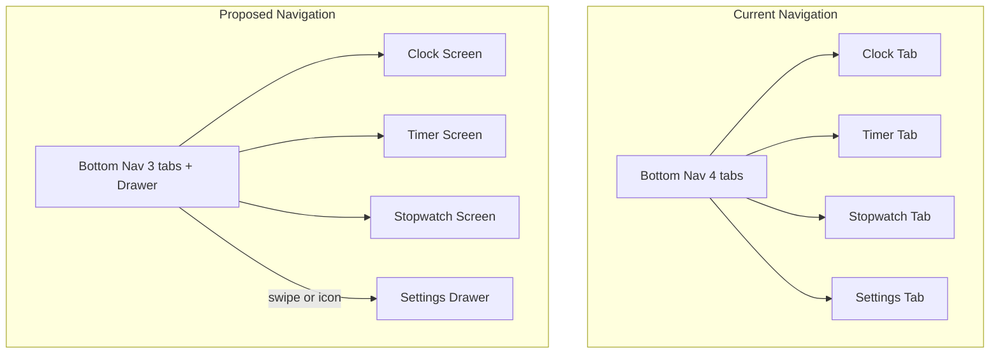
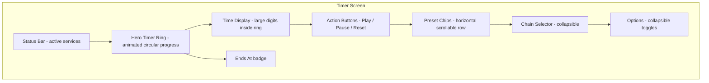

# SolasFlow UI Redesign Plan

## Problem Statement

The current UI suffers from several issues:

1. **Inconsistent theming** — Mixes custom [`Palette`](lib/theme/palette.dart) (3 hardcoded colors) with Material 3 [`ColorScheme`](lib/main.dart:200). Tab builders use hardcoded `Color(0xFFFEFBFF)` that breaks in dark mode.
2. **Overloaded panels** — [`TimerPanel`](lib/widgets/timer_panel.dart) (954 lines), [`SettingsPanel`](lib/widgets/settings_panel.dart) (843 lines), [`StopwatchPanel`](lib/widgets/stopwatch_panel.dart) (615 lines), and [`ClockPanel`](lib/widgets/clock_panel.dart) (546 lines) each cram display, controls, and settings into a single scrollable view with no visual hierarchy.
3. **Utilitarian presets** — [`PresetsPanel`](lib/widgets/presets_panel.dart) renders a cramped 5-column grid of small bordered boxes using the old palette system.
4. **No status awareness** — Active services (clock speech, audio, TTS) have no visible indicators on the main screen.
5. **Flat visual design** — All content sits at the same visual weight with basic [`panelContainer`](lib/widgets/ui_helpers.dart:4) borders.

## Design Direction

**Modern Material 3 with clear visual hierarchy:**
- Hero-style display areas dominate each tab (top ~55%)
- Controls are prominent and touch-friendly
- Settings/options collapse into expandable sections or move to a drawer
- Consistent color token usage via `Theme.of(context).colorScheme` only
- Animated state transitions (idle → running → paused)
- Status bar showing active services

## Architecture Decision

**Focus: UI layer only.** The service layer ([`TimerService`](lib/services/timer_service.dart), [`AudioService`](lib/services/audio_service.dart), etc.) is well-structured and stays untouched. State variables in [`_MainScreenState`](lib/main.dart:335) remain as-is. Only the widget tree, theme, and layout change.

---

## Visual Concept

### Timer Screen Layout

---

## Phase 1 — Theme Foundation

**Goal:** Establish a single, consistent theme system using Material 3 `ColorScheme` tokens everywhere.

### Changes:
- **[`lib/theme/palette.dart`](lib/theme/palette.dart)** — Gut the file. Replace the custom `Palette` class with a thin helper that returns `Theme.of(context).colorScheme` tokens, OR delete it entirely and update all consumers.
- **[`lib/widgets/ui_helpers.dart`](lib/widgets/ui_helpers.dart)** — Rewrite [`panelContainer()`](lib/widgets/ui_helpers.dart:4), [`headerTitle()`](lib/widgets/ui_helpers.dart:19), [`sectionLabel()`](lib/widgets/ui_helpers.dart:57), [`actionBtn()`](lib/widgets/ui_helpers.dart:72) to accept `BuildContext` and use `Theme.of(context).colorScheme` instead of `palette.primary`/`palette.accent`.
- **[`lib/widgets/presets_panel.dart`](lib/widgets/presets_panel.dart)** — Remove `import '../theme/palette.dart'` and `import 'ui_helpers.dart'` palette references.
- **[`lib/main.dart`](lib/main.dart:172)** — Remove hardcoded `Color(0xFFFEFBFF)` and `Color(0xFFFCFAFF)` from [`_buildSpeakClockTab()`](lib/main.dart:2719), [`_buildTimerSetupTab()`](lib/main.dart:2818), [`_buildStopwatchTab()`](lib/main.dart:2914). Use `scheme.surface` instead.
- **[`lib/main.dart`](lib/main.dart:221)** — Enhance [`_buildSolasFlowTheme()`](lib/main.dart:221) with richer component themes: cards, dialogs, input decorations, progress indicators.

---

## Phase 2 — Navigation Restructure

**Goal:** Simplify from 4-tab bottom nav to 3 tabs + settings drawer.

### Changes:
- **[`lib/main.dart`](lib/main.dart:3738)** — Reduce `NavigationBar` destinations from 4 to 3: Clock, Timer, Stopwatch. Remove Settings destination.
- **[`lib/main.dart`](lib/main.dart:3660)** — Add a `Drawer` (or `endDrawer`) widget to the `Scaffold` containing the [`SettingsPanel`](lib/widgets/settings_panel.dart) content.
- **[`lib/main.dart`](lib/main.dart:3731)** — Remove `_buildSettingsTab()` from the tab switcher. Add settings icon button in the AppBar that opens the drawer.
- **[`lib/main.dart`](lib/main.dart:3660)** — Add an AppBar (currently `null` for all tabs) with: app title, settings drawer toggle, fullscreen button, shutdown button. This replaces the per-tab header rows.

---

## Phase 3 — Timer Screen Redesign

**Goal:** Transform [`TimerPanel`](lib/widgets/timer_panel.dart) from a wall of settings into a focused, hero-driven timer experience.

### New widget files:
- `lib/widgets/timer_ring.dart` — Extracted animated [`_TimerRingPainter`](lib/widgets/timer_panel.dart:239) with pulse/breath animation when running.
- `lib/widgets/preset_chip_bar.dart` — Horizontal scrollable row of [`Chip`](lib/widgets/timer_panel.dart:379) widgets replacing the 5-column grid.

### Changes to [`TimerPanel`](lib/widgets/timer_panel.dart):
- **Hero area (top ~55%)**: Animated timer ring with large time digits, "Remaining time" label, "Ends at" badge, and chain progress indicator.
- **Action buttons (below ring)**: Large, full-width Play/Pause + Reset buttons with clear iconography. Keep existing [`_actions()`](lib/widgets/timer_panel.dart:379) logic but restyle.
- **Preset chips**: Replace [`PresetsPanel`](lib/widgets/presets_panel.dart) 5-column grid with a horizontal scrollable chip bar. Show popular presets (5, 10, 15, 20, 25, 30, 45, 60) inline.
- **Collapsible options**: Group timer settings (speech, noise, milliseconds, announce interval, chain mode) into an `ExpansionTile` or animated expand/collapse section at the bottom. Default collapsed.
- **Remove**: The `_settingsCard` / `_switchRow` / `_optionRow` patterns that currently create visual noise.

---

## Phase 4 — Stopwatch Screen Redesign

**Goal:** Apply the same hero-driven approach to [`StopwatchPanel`](lib/widgets/stopwatch_panel.dart).

### Changes to [`StopwatchPanel`](lib/widgets/stopwatch_panel.dart):
- **Hero area**: Large elapsed time display (reuse timer ring style but without progress, or a clean digital display).
- **Action buttons**: Start/Stop, Lap, Reset as prominent buttons.
- **Lap list**: Clean lap display with delta times (already partially exists via [`lapTimes`](lib/widgets/stopwatch_panel.dart:13)).
- **Collapsible options**: Speech toggle, show milliseconds, speak delay — collapsed by default.

---

## Phase 5 — Clock Screen Redesign

**Goal:** Make [`ClockPanel`](lib/widgets/clock_panel.dart) a clean, glanceable clock with quick toggles.

### Changes to [`ClockPanel`](lib/widgets/clock_panel.dart):
- **Hero area**: Large clock display (existing [`_timeCard()`](lib/widgets/clock_panel.dart:194) is a good start) with AM/PM badge and seconds/milliseconds.
- **Quick toggle row**: Horizontal row of toggle chips for Clock Speech, Noise, Motivation — one-tap on/off without navigating to settings.
- **Status indicators**: Show active service badges (speech active, audio playing).
- **Goals integration**: Collapse goals section into a card here (it currently exists as [`_buildGoalsTab()`](lib/main.dart:3182) but is unreachable from the nav). Add a collapsible "Today's Goals" card below the clock.
- **Remove**: Long scrollable lists of clock configuration. Move detailed settings to the drawer.

---

## Phase 6 — Settings Drawer

**Goal:** Convert [`SettingsPanel`](lib/widgets/settings_panel.dart) from a full tab to a slide-out drawer.

### New file:
- `lib/screens/settings_drawer.dart` — Drawer widget wrapping the settings content.

### Changes:
- Group settings into collapsible sections: **Audio**, **Speech / TTS**, **Display**, **Sleep Mode**, **About / Help**.
- Each section uses a Material 3 `Card` with consistent padding and typography.
- The drawer replaces the Settings tab entirely.
- Help content (currently [`HelpPanel`](lib/widgets/help_panel.dart)) moves into an "About" section or a sub-route accessed from the drawer.

---

## Phase 7 — Shared Components

**Goal:** Create reusable, theme-aware widget building blocks.

### New files:
- `lib/widgets/status_bar.dart` — Compact row of active-service indicator chips (clock active, audio playing, TTS speaking, timer running). Shown at the top of each screen.
- `lib/widgets/section_card.dart` — Reusable card with consistent Material 3 styling, replacing the ad-hoc `_settingsCard` / `_switchRow` patterns found in multiple panels.
- `lib/widgets/hero_display.dart` — Reusable large number display component with optional unit label, used by both timer and stopwatch.

---

## Phase 8 — Fullscreen Views Polish

**Goal:** Minor visual consistency updates to [`FullscreenFocusView`](lib/widgets/fullscreen_focus_view.dart) and [`FullscreenStopwatchView`](lib/widgets/fullscreen_stopwatch_view.dart).

### Changes:
- Use the same design language (colors, typography scale) as the redesigned main screens.
- Already look good — mainly ensure color tokens match the new theme.
- Add subtle gradient background option (already has dark/light toggle).

---

## Phase 9 — Cleanup

- Remove [`lib/widgets/presets_panel.dart`](lib/widgets/presets_panel.dart) (replaced by `preset_chip_bar.dart`).
- Remove [`lib/theme/palette.dart`](lib/theme/palette.dart) or reduce to a no-op.
- Verify all `import '../theme/palette.dart'` references are removed.
- Verify all `import 'ui_helpers.dart'` usages are updated.
- Run `flutter analyze` to catch any remaining issues.

---

## Files Modified Summary

| File | Action | Phase |
|------|--------|-------|
| [`lib/theme/palette.dart`](lib/theme/palette.dart) | Gut/delete | 1 |
| [`lib/widgets/ui_helpers.dart`](lib/widgets/ui_helpers.dart) | Rewrite | 1 |
| [`lib/widgets/presets_panel.dart`](lib/widgets/presets_panel.dart) | Delete (replaced) | 3 |
| [`lib/main.dart`](lib/main.dart) | Major restructure | 1-2 |
| [`lib/widgets/timer_panel.dart`](lib/widgets/timer_panel.dart) | Major rewrite | 3 |
| [`lib/widgets/stopwatch_panel.dart`](lib/widgets/stopwatch_panel.dart) | Major rewrite | 4 |
| [`lib/widgets/clock_panel.dart`](lib/widgets/clock_panel.dart) | Major rewrite | 5 |
| [`lib/widgets/settings_panel.dart`](lib/widgets/settings_panel.dart) | Convert to drawer content | 6 |
| [`lib/widgets/help_panel.dart`](lib/widgets/help_panel.dart) | Minor updates | 6 |
| [`lib/widgets/fullscreen_focus_view.dart`](lib/widgets/fullscreen_focus_view.dart) | Polish | 8 |
| [`lib/widgets/fullscreen_stopwatch_view.dart`](lib/widgets/fullscreen_stopwatch_view.dart) | Polish | 8 |
| `lib/widgets/timer_ring.dart` | **NEW** | 3 |
| `lib/widgets/preset_chip_bar.dart` | **NEW** | 3 |
| `lib/widgets/status_bar.dart` | **NEW** | 7 |
| `lib/widgets/section_card.dart` | **NEW** | 7 |
| `lib/widgets/hero_display.dart` | **NEW** | 7 |
| `lib/screens/settings_drawer.dart` | **NEW** | 6 |

## What Does NOT Change

- All service files (`lib/services/*`) — untouched
- All model files (`lib/models/*`) — untouched
- All l10n files (`lib/l10n/*`) — untouched
- All feature files (`lib/features/*`) — untouched
- State variables and business logic in [`_MainScreenState`](lib/main.dart:335) — untouched
- Fullscreen view logic — only visual polish
