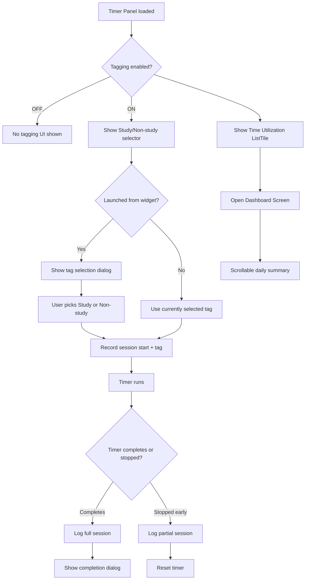

# V10 — Study/Non-Study Tagging & Time Utilization Dashboard

## Overview

Add an **opt-in session tagging system** (Study vs Non-Study) and a **time utilization dashboard** to track daily focus hours. Users can enable/disable tagging from the timer tab. When enabled, users classify each timer session as "Study" (focused learning) or "Non-study" (casual). Completed sessions are logged and visualized in a scrollable dashboard grouped by day.

---

## Feature Toggle — Master Switch

A **"Tagging" toggle** in the timer panel controls the entire feature:

- **OFF (default)**: No tagging UI, no session logging, no dashboard ListTile
- **ON**: Shows Study/Non-Study selector, logs sessions, shows "Time Utilization" dashboard entry

This ensures users who don't want this feature are never bothered by it.

---

## Feature Breakdown

### 1. Master Tagging Toggle + Study/Non-Study Selector in Timer Panel

Add two elements in [`lib/widgets/timer_panel.dart`](lib/widgets/timer_panel.dart), below the existing feature toggle row (Speech, Noise, Chain, Clock) around line 362:

**a) Tagging master toggle** — a `_FeatureToggle` card labeled "Tagging" with an icon like `Icons.label_rounded`. When OFF, the Study/Non-Study selector and dashboard ListTile are hidden.

**b) Study / Non-Study selector** — shown only when tagging is ON. Two chips side by side:
- "Study" (book icon) — default selection
- "Non-study" (other icon)
- Same visual style as `_FeatureToggle` cards
- Selection persists across app restarts

### 2. Session Log Data Model

**New file**: `lib/models/session_log.dart`

```dart
class SessionLog {
  final DateTime startTime;
  final DateTime endTime;
  final int durationSeconds;
  final String tag; // "study" | "non-study"

  // JSON serialization
  // fromJson / toJson
}
```

### 3. Session Log Service

**New file**: `lib/services/session_log_service.dart`

**Storage**: JSON array in SharedPreferences under key `SessionLogs`.

**Operations**:
- `logSession(SessionLog)` — append a session
- `getSessionsForDate(DateTime date)` — all sessions for a given day
- `getDailySummary(DateTime date)` — returns `{study: totalSeconds, nonStudy: totalSeconds}`
- `pruneOlderThan(Duration)` — cleanup entries older than 90 days

### 4. State Changes

**Modified files**:
- [`lib/core/pref_keys.dart`](lib/core/pref_keys.dart) — add `taggingOn`, `sessionTag`, `sessionLogs` keys
- [`lib/models/app_settings.dart`](lib/models/app_settings.dart) — add `taggingOn` (bool) and `sessionTag` (String) fields
- [`lib/providers/app_state.dart`](lib/providers/app_state.dart) — add `taggingOn` and `sessionTag` to `SettingsState` + `RuntimeState`
- [`lib/services/settings_service.dart`](lib/services/settings_service.dart) — load/save new fields

### 5. Session Recording in Timer Lifecycle

Modify [`lib/main.dart`](lib/main.dart):

**On timer start** ([`startTimer()`](lib/main.dart:3052)): If tagging is ON, capture `_sessionStartTime = DateTime.now()` and `_sessionTag = currentSessionTag`.

**On timer completion** ([`tick()`](lib/main.dart:2624)): If tagging is ON, log the completed session via `SessionLogService`.

**On timer stop/reset while running**: If tagging is ON, log the partial session.

### 6. Dashboard Entry in Timer Panel

Add a **"Time Utilization"** ListTile below the settings rows in [`lib/widgets/timer_panel.dart`](lib/widgets/timer_panel.dart), only visible when tagging is ON.

**Appearance**: Card with icon `Icons.analytics_rounded`, title "Time Utilization", subtitle: today's summary (e.g., "Study 2h 15m · Non-study 45m").

**Tap**: Opens Dashboard screen via `Navigator.push`.

### 7. Dashboard Screen

**New files**:
- `lib/widgets/dashboard_screen.dart` — main scrollable screen
- `lib/widgets/day_summary_card.dart` — reusable card for each day

**Layout** — single scrollable `ListView`:

```
┌─────────────────────────────┐
│  📊 Time Utilization        │  ← AppBar
├─────────────────────────────┤
│  TODAY — 28 Jul 2026        │  ← Day header
│  ┌─────────────────────────┐│
│  │ 📚 Study      2h 15m    ││  ← Green card
│  │ 🎯 Non-study     45m    ││  ← Amber card
│  └─────────────────────────┘│
├─────────────────────────────┤
│  YESTERDAY — 27 Jul 2026    │
│  ┌─────────────────────────┐│
│  │ 📚 Study      1h 30m    ││
│  │ 🎯 Non-study   1h 00m   ││
│  └─────────────────────────┘│
├─────────────────────────────┤
│  26 Jul 2026                │
│  ...                        │
└─────────────────────────────┘
```

**Design tokens**: Study uses accent green, Non-study uses amber. Uses existing [`AppColors`](lib/theme/app_colors.dart).

**Modular**: `DaySummaryCard` is a separate widget that can later accept an `onTap` callback for session detail drill-down.

### 8. Widget Launch Tag Selection Popup

When launched from a **home screen widget** (preset button like `start_25m`) AND tagging is ON, show a **popup dialog** asking the user to pick Study or Non-study before the timer starts.

**Location**: [`_handleWidgetAction()`](lib/main.dart:1734) — in the `presetMap` block (line 1801).

**Flow**:
```
Widget tap → _handleWidgetAction → tagging ON? 
  → Yes: show dialog → user picks → set tag → startTimer → open fullscreen
  → No: startTimer → open fullscreen (as before)
```

**Dialog**: Simple two-button dialog matching app theme, similar to [`_showFullscreenTimerFinishedDialog()`](lib/main.dart:2891).

---

## File Changes Summary

| File | Action | Description |
|------|--------|-------------|
| `lib/models/session_log.dart` | **NEW** | SessionLog data class with JSON serialization |
| `lib/services/session_log_service.dart` | **NEW** | Session logging, querying, and pruning |
| `lib/widgets/dashboard_screen.dart` | **NEW** | Dashboard UI — scrollable daily view |
| `lib/widgets/day_summary_card.dart` | **NEW** | Reusable day summary card widget |
| `lib/core/pref_keys.dart` | MODIFY | Add `taggingOn`, `sessionTag`, `sessionLogs` |
| `lib/models/app_settings.dart` | MODIFY | Add `taggingOn`, `sessionTag` fields |
| `lib/providers/app_state.dart` | MODIFY | Add to SettingsState + copyWith + Notifier |
| `lib/services/settings_service.dart` | MODIFY | Load/save new fields |
| `lib/widgets/timer_panel.dart` | MODIFY | Add tagging toggle + study selector + dashboard ListTile |
| `lib/main.dart` | MODIFY | Session recording + widget popup + wiring |

---

## Mermaid Flow — Feature Toggle & Session Lifecycle



---

## Implementation Order

1. **Data layer**: `SessionLog` model + `SessionLogService` + PrefKeys
2. **State wiring**: `taggingOn` + `sessionTag` in SettingsState/RuntimeState/SettingsService
3. **Timer panel UI**: Tagging toggle + Study/Non-Study selector + dashboard ListTile
4. **Session recording**: Hook into timer start, completion, stop, reset
5. **Dashboard screen**: `DaySummaryCard` + `DashboardScreen`
6. **Widget launch popup**: Tag dialog in `_handleWidgetAction()`
7. **Tests**: Unit tests for SessionLogService

---

## Key Decisions

- **Opt-in by default**: Tagging is OFF by default. Users explicitly enable it.
- **SharedPreferences over SQLite**: JSON storage sufficient for v1. ~50KB for 90 days of heavy use.
- **90-day retention**: Auto-pruning keeps storage minimal.
- **Tag is per-session**: Each logged session stores its own tag. The selector sets the tag for the *next* session.
- **No logging when tagging OFF**: Clean separation — no overhead for users who don't want this.
- **Modular DaySummaryCard**: Extracted for future drill-down into individual sessions.
